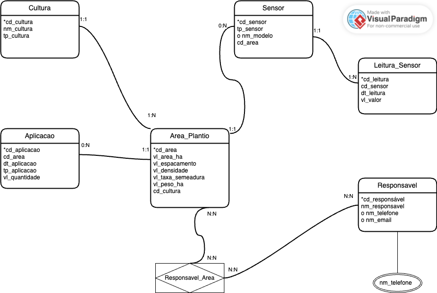
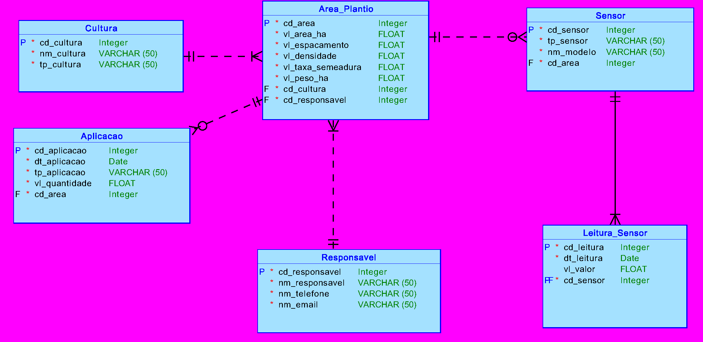
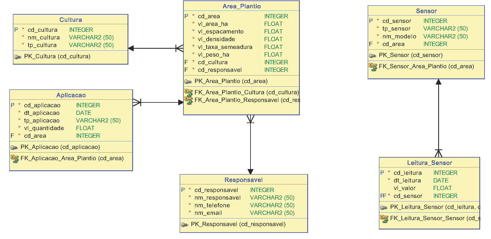

# FIAP - Faculdade de Informática e Administração Paulista

<p align="center">
<a href= "https://www.fiap.com.br/"></a>
</p>

<br>

# Farmtech

## Nome do grupo

## 👨‍🎓 Integrantes: 
- <a href="https://www.linkedin.com/in/joão-vitor-severo-oliveira-87904134b/">João Vitor Severo Oliveira -rm566251</a>
- <a href="https://www.linkedin.com/company/inova-fusca">Jonas Luis da Silva - rm561465</a>
- <a href="https://www.linkedin.com/in/renan-francisco-de-paula-b3320915b/">Renan Francisco de Paula - rm561454</a> 

## 👩‍🏫 Professores:
### Tutor(a) 
- <a href="https://www.linkedin.com/company/inova-fusca">Lucas Gomes Moreira</a>
### Coordenador(a)
- <a href="https://www.linkedin.com/company/inova-fusca">ANDRÉ GODOI CHIOVATO</a>


## 📜 Descrição


A **FarmTech Solutions** propõe um sistema de banco de dados relacional voltado à agricultura digital, com foco em **monitoramento inteligente de plantações** por meio de sensores de precisão. O projeto foi desenvolvido com base em um cenário realista no qual um produtor rural utiliza sensores para coletar dados ambientais a fim de **otimizar o uso de recursos naturais** e **insumos agrícolas**, como água, fertilizantes e nutrientes.

## Contexto e Motivação

O agricultor planta diversas culturas agrícolas em diferentes áreas de plantio, cada uma com características distintas de solo, clima e demanda nutricional. Para aumentar a produtividade e garantir sustentabilidade, são utilizados três tipos principais de sensores:

- **Sensor de Umidade (S1):** monitora a umidade do solo para ajustes na irrigação.  
- **Sensor de pH (S2):** mede a acidez do solo, essencial para absorção adequada de nutrientes.  
- **Sensor de Nutrientes (S3):** capta os níveis de fósforo (P) e potássio (K), que fazem parte do complexo NPK.

Estes sensores são instalados nas áreas de cultivo e enviam suas leituras automaticamente a um sistema central. Com base nas leituras, são feitas aplicações direcionadas de água ou nutrientes, registradas também no sistema.

O banco de dados é, portanto, essencial não só para o **armazenamento das informações**, mas para permitir **consultas analíticas** que gerem **insumos preditivos**, otimizando recursos ao longo do ciclo da lavoura.

### 🎯 Objetivo Geral

Desenvolver um **Modelo Entidade-Relacionamento (MER)** e seu correspondente **DER** (Diagrama Entidade-Relacionamento) que sirvam como base para a implementação de um sistema de gestão de sensoriamento, aplicação e análise de dados agronômicos em tempo real.

O modelo permite registrar, consultar e cruzar informações das leituras e aplicações realizadas, promovendo **decisões orientadas por dados**.

### 🔧 Principais Funcionalidades

- Registro de culturas e suas características.
- Cadastro de áreas de plantio e suas métricas (hectares, espaçamento, densidade).
- Instalação e identificação dos sensores em cada área.
- Registro automático das leituras de sensores com data e valor coletado.
- Registro de aplicações realizadas (água, nutrientes, fertilizantes), com volume e data.
- Associação entre responsáveis técnicos e áreas de cultivo.
- Suporte à análise de dados históricos para gerar previsões e diagnósticos agronômicos.

### 🧱 Estrutura do Modelo

O modelo é composto por entidades como:

- `Cultura`
- `Área_Plantio`
- `Sensor`
- `Leitura_Sensor`
- `Aplicacao`
- `Responsavel`

Cada entidade possui atributos específicos que descrevem os dados essenciais para controle e análise. A **cardinalidade de cada relacionamento** foi modelada com base nas regras de negócio extraídas do cenário real:

- Uma cultura pode ser plantada em várias áreas.
- Cada sensor deve estar vinculado a uma área específica.
- As leituras dos sensores são únicas para cada instante e dispositivo.

O modelo também contempla **atributos compostos e multivalorados**, como:

- **Telefone:** pode conter diferentes números para um mesmo responsável.
- **Nome:** pode ser decomposto em nome e sobrenome.

### 📘 MER (Modelo Entidade-Relacionamento)

Todos os detalhes do modelo conceitual (MER), incluindo os atributos, cardinalidades mínimas e máximas, classificações (chave primária, estrangeira, composta ou multivalorada), bem como os relacionamentos entre as entidades, estão documentados no arquivo abaixo:

📄 [MER_farmtech.pdf](document/MER_farmtech.pdf)

Esse arquivo também traz o mapeamento completo conforme as regras de negócio levantadas, além de uma explicação clara de cada entidade e suas relações.

### 🖼️ Visão gráfica do MER
Abaixo, uma versão simplificada do diagrama conceitual para visualização rápida:



### 🖼️ Visão gráfica do DER Lógico e Relacional
Abaixo, a versão do diagrama lógico e relacional para visualização rápida:





## ✅ Conclusão

O projeto da **FarmTech Solutions** viabiliza a construção de um sistema de informação **robusto e escalável**, alinhado à realidade da **agricultura de precisão**. Com ele, é possível **integrar sensores e automações** com o banco de dados para facilitar a **gestão agronômica** e fornecer **suporte às decisões** com base em dados históricos e em tempo real.

A modelagem segue as **boas práticas de banco de dados relacional** e representa um **primeiro passo para a transformação digital no campo**.


## 📁 Estrutura de pastas

Dentre os arquivos e pastas presentes na raiz do projeto, definem-se:

- <b>.github</b>: Pasta utilizada para armazenar arquivos de configuração específicos do GitHub, como templates de issues, pull requests e workflows de CI/CD. Atualmente, está preparada para conter templates de relatórios de problemas e sugestões de melhoria no projeto, facilitando a padronização das contribuições.

- <b>assets</b>: Contém todos os recursos visuais do projeto, como o diagrama conceitual MER (MER.png), o diagrama físico DER (DER_logico.png e DER_Relational.png) e logo FIAP (logo-fiap.png).

- <b>config</b>: Armazena arquivos técnicos e de configuração do projeto. Aqui está incluído o modelo de banco relacional exportado do SQL Developer (modeloder.dmd), fundamental para a construção do DER.

- <b>document</b>: Diretório onde ficam os documentos oficiais do projeto. Contém os arquivos MER_farmtech.pdf e Regras_de_Negocio.pdf, que representam a modelagem conceitual e o levantamento das regras de negócio, respectivamente. A subpasta other/ pode conter materiais auxiliares como resumos de artigos ou rascunhos.

- <b>scripts</b>: Esta pasta pode conter scripts auxiliares para tarefas de automação, backup, deploy ou integração de dados. Nele se encontra o arquivo DDL de script SQL.

- <b>src</b>: Contém todo o código-fonte do projeto. Inclui os arquivos Python responsáveis pela manipulação de dados (main.py, interface.py, calculos.py etc.), bem como os arquivos de dados utilizados pelo sistema, como o dados.json localizado em src/data/. Também pode conter scripts em R para análises estatísticas, agrupados em src/R/.

- <b>README.md</b>: Arquivo principal de documentação do repositório. Explica o propósito do projeto, os requisitos, estrutura das pastas, como executar o sistema, e apresenta os diagramas e a modelagem.

## 🔧 Como executar o código

- É necessário ter o Python 3.x instalado para executar os scripts da pasta `src/`.
- O arquivo `dados.json` contém os dados utilizados nos cálculos de produtividade e aplicação.
- Para modelagem e edição do DER, foi utilizado o **Oracle SQL Developer Data Modeler**.

### 1. Clone o repositório:
```bash
git clone https://github.com/jonsilva91/Farmtech/tree/main/Fase%2002/Cap01
```
### 2. Execute o sistema:
```bash
python main.py
```
#### 🧭 Como abrir o arquivo `modeloder.dmd` no Oracle SQL Developer Data Modeler

1. Abra o **Oracle SQL Developer Data Modeler**.
2. No menu superior, clique em **File > Open**.
3. Navegue até a pasta `config` do projeto.
4. Selecione o arquivo `modeloder.dmd`.
5. Clique em **Open** para visualizar o modelo relacional.

## 🗃 Histórico de lançamentos

* 0.2.0 - 22/04/2025
    * 
* 0.1.0 - 25/03/2025
    *

## 📋 Licença

<p xmlns:cc="http://creativecommons.org/ns#" xmlns:dct="http://purl.org/dc/terms/"><a property="dct:title" rel="cc:attributionURL" href="https://github.com/agodoi/template">MODELO GIT FIAP</a> por <a rel="cc:attributionURL dct:creator" property="cc:attributionName" href="https://fiap.com.br">Fiap</a> está licenciado sobre <a href="http://creativecommons.org/licenses/by/4.0/?ref=chooser-v1" target="_blank" rel="license noopener noreferrer" style="display:inline-block;">Attribution 4.0 International</a>.</p>


