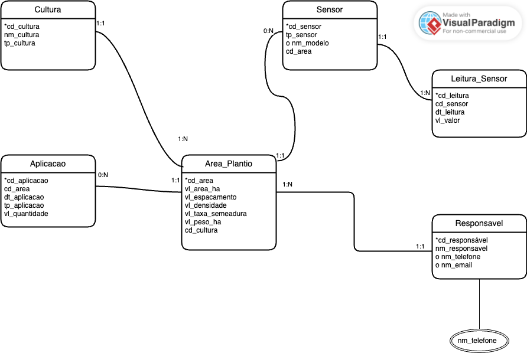
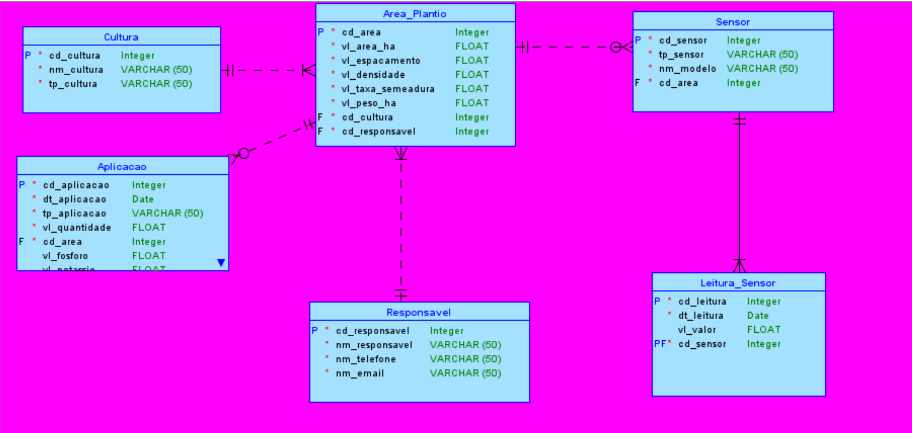
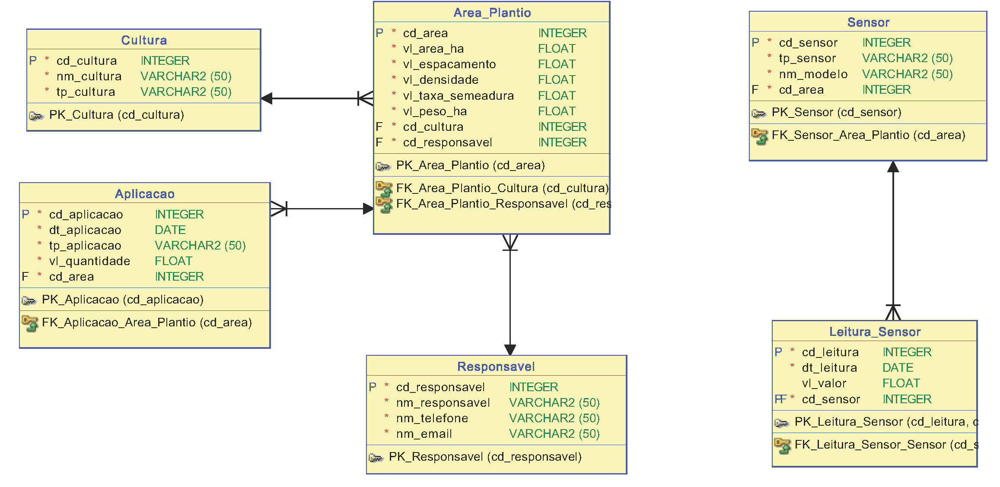

# FIAP - Faculdade de Informática e Administração Paulista

<p align="center">
<a href="https://www.fiap.com.br/"></a>
</p>

<br>

# Farmtech

## Equipe rocket

## 👨‍🎓 Integrantes: 
- <a href="https://www.linkedin.com/in/jonas-silva-0a659892/">Jonas Luis da Silva</a>
- <a href="https://www.linkedin.com/in/renan-francisco-de-paula-b3320915b/overlay/about-this-profile/">Renan Francisco de Paula</a>
- <a href="https://www.linkedin.com/in/jo%C3%A3o-vitor-severo-oliveira-87904134b/">João Vitor Severo Oliveira</a> 
- <a href="https://www.linkedin.com/in/isagomesferreira/">Isabelle Gomes Ferreira</a> 
- <a href="https://www.linkedin.com/in/edson-henrique-felix-batista-a00191123/">Edson Henrique Felix Batista</a>

## 👩‍🏫 Professores:
### Tutor(a) 
- <a href="https://www.linkedin.com/company/inova-fusca">Lucas Gomes Moreira</a>
### Coordenador(a)
- <a href="https://www.linkedin.com/company/inova-fusca">André Godoi Chiovato</a>


---

## 📜 Descrição

A **FarmTech Solutions** entra na terceira fase do projeto com foco em armazenar e visualizar dados oriundos de sensores simulados de umidade, pH e nutrientes (P e K), além de controlar a irrigação conforme lógica definida. O sistema foi desenvolvido em Python com uso de banco de dados relacional, interface visual e dashboards interativos.

---

## Contexto e Motivação

Nesta etapa, implementaremos o banco de dados e realizaremos a coleta de dados em campo utilizando o microcontrolador ESP32. O programa em Python simula o funcionamento dos sensores e já conta com um módulo chamado `irrigar.py`, onde toda a lógica de controle da irrigação está implementada e comentada, pronta para integração com o ESP32 por meio de comunicação serial, podendo futuramente utilizar protocolos em nuvem como MQTT.

O dashboard desenvolvido em Streamlit faz uso de dados simulados nesta fase, mas já está estruturado para receber dados reais assim que a comunicação com o microcontrolador for ativada. Isso garante flexibilidade para testes e evolução do projeto em ambientes reais ou simulados.


---

### 🎯 Objetivo Geral

Desenvolver um sistema funcional com armazenamento, análise e visualização de dados agrícolas simulados, suportando decisões automatizadas de aplicação com base nas leituras. Cálculos de aplicações e adubação podem ser encontradas no readme Fase 01, o objetivo do projeto no futuro é o registro de maquinário personalizado para facilitar os cálculos

---

### 🔧 Principais Funcionalidades

- Registro e visualização de culturas e áreas de plantio.  
- Leitura simulada de sensores de umidade (detectado via API automaticamente), pH e nutrientes.  
- Registro de aplicações (adubação/fungicida) com valores de NPK e descrição de produtos.  
- Interface com Streamlit para gráficos e controle.  
- CRUD completo.  
- Pronto para futura integração ESP32/Wokwi.  

---

### 🧱 Estrutura do Modelo

- `Cultura`
- `Área_Plantio`
- `Sensor`
- `Leitura_Sensor`
- `Aplicacao`
- `Responsavel`

O modelo foi adaptado para comportar aplicações com valores individuais de fósforo, potássio, nitrogênio e produto químico utilizado.

---

### 📘 MER (Modelo Entidade-Relacionamento)

📄 [MER_farmtech.pdf](document/MER_farmtech.pdf)

---

### 🖼️ Visão gráfica do MER


---

### 🖼️ Visão gráfica do DER Lógico e Relacional
  


---
## 🔌 Lógica e Integração com o ESP32

A primeira parte da entrega contempla a simulação do circuito de sensores utilizando a plataforma **Wokwi** com **ESP32**, representando sensores agrícolas como:

- Sensor de umidade (DHT22)
- Sensor de pH (via LDR)
- Sensor de fósforo e potássio (via botões digitais)
- Relé para simulação de bomba de irrigação (acionado por lógica condicional)

### 📟 Código do ESP32

Segue abaixo o código comentado do ESP32:

````
Inserir aqui
````

### 🖼️ Circuito

  

### 🔁 Integração com Python

- Dados do ESP32 podem ser capturados via **monitor serial**.
- O script Python da aplicação já contém o módulo `irrigar.py`, com lógica pronta e comentada para:
  - Leitura via `serial` do ESP32.
  - Possível futura comunicação via protocolos como **MQTT** para integração em nuvem.
- O banco de dados relacional simula o armazenamento das leituras e aplicações, estando pronto para receber dados reais.
---
## 🗃️ Justificativa da Modelagem do Banco de Dados

Durante o desenvolvimento desta fase, foi necessário **ajustar o modelo de dados originalmente proposto** para melhor refletir a realidade da aplicação e permitir a **flexibilidade no registro de diferentes tipos de insumos** (como fertilizantes e fungicidas), além de assegurar a escalabilidade do sistema.

### 🔄 Alterações Realizadas

A principal mudança ocorreu na tabela `Aplicacao`, que foi **expandida** para armazenar tanto **aplicações de adubação NPK** quanto **fungicidas**, sem a necessidade de criar múltiplas tabelas para cada tipo. Isso foi feito por meio dos seguintes campos adicionados:

- `vl_fosforo`, `vl_potassio`, `vl_nitrogenio`: valores individuais dos nutrientes aplicados (opcional). As tabelas desse README já estão atualizadas.
- `ds_produto`: descrição do produto químico utilizado, geralmente em aplicações de fungicidas.
- `tp_aplicacao`: tipo da aplicação, indicando se o registro se refere a adubação, fungicida ou outro insumo.

Essa abordagem garante que o sistema consiga **armazenar aplicações distintas com estrutura unificada**, facilitando consultas, relatórios e a integração com os sensores e o controle da irrigação.

### 🧱 Estrutura Atual do Banco

O banco de dados está normalizado e estruturado conforme boas práticas de modelagem relacional. Abaixo estão as tabelas principais:

- `Cultura`: Define as culturas agrícolas cadastradas.
- `Responsavel`: Armazena os dados dos técnicos responsáveis pelas áreas de plantio.
- `Area_Plantio`: Registra os atributos de cada área cultivada, com chave estrangeira para cultura e responsável.
- `Sensor`: Cada sensor instalado em uma área específica.
- `Leitura_Sensor`: Leitura dos sensores com data e valor.
- `Aplicacao`: Tabela unificada para adubação e defensivos, agora com campos adicionais.

### 📌 Vantagens da modelagem atual

- **Evita duplicidade** de tabelas para diferentes tipos de aplicação.
- **Facilita a integração** com o ESP32 e sistemas externos via serial ou nuvem.
- Permite **consultas mais eficientes** com menos junções e menos complexidade.
- Tabela `Aplicacao` flexível, com campos opcionais, que permite **expansão futura** para novos tipos de insumos.

Abaixo segue o SQL final utilizado para gerar o banco relacional.

---

### 🧾 Script SQL Final

```sql
-- Criação da tabela Cultura
CREATE TABLE Cultura (
    cd_cultura INTEGER NOT NULL,
    nm_cultura VARCHAR2(50) NOT NULL,
    tp_cultura VARCHAR2(50) NOT NULL,
    CONSTRAINT PK_Cultura PRIMARY KEY (cd_cultura)
);

-- Criação da tabela Responsavel
CREATE TABLE Responsavel (
    cd_responsavel INTEGER NOT NULL,
    nm_responsavel VARCHAR2(50) NOT NULL,
    nm_telefone VARCHAR2(50) NOT NULL,
    nm_email VARCHAR2(50) NOT NULL,
    CONSTRAINT PK_Responsavel PRIMARY KEY (cd_responsavel)
);

-- Criação da tabela Area_Plantio
CREATE TABLE Area_Plantio (
    cd_area INTEGER NOT NULL,
    vl_area_ha FLOAT NOT NULL,
    vl_espacamento FLOAT NOT NULL,
    vl_densidade FLOAT NOT NULL,
    vl_taxa_semeadura FLOAT NOT NULL,
    vl_peso_ha FLOAT NOT NULL,
    cd_cultura INTEGER NOT NULL,
    cd_responsavel INTEGER NOT NULL,
    CONSTRAINT PK_Area_Plantio PRIMARY KEY (cd_area),
    CONSTRAINT FK_Area_Plantio_Cultura FOREIGN KEY (cd_cultura) REFERENCES Cultura(cd_cultura),
    CONSTRAINT FK_Area_Plantio_Responsavel FOREIGN KEY (cd_responsavel) REFERENCES Responsavel(cd_responsavel)
);

-- Criação da tabela Sensor
CREATE TABLE Sensor (
    cd_sensor INTEGER NOT NULL,
    tp_sensor VARCHAR2(50) NOT NULL,
    nm_modelo VARCHAR2(50) NOT NULL,
    cd_area INTEGER NOT NULL,
    CONSTRAINT PK_Sensor PRIMARY KEY (cd_sensor),
    CONSTRAINT FK_Sensor_Area_Plantio FOREIGN KEY (cd_area) REFERENCES Area_Plantio(cd_area)
);

-- Criação da tabela Leitura_Sensor
CREATE TABLE Leitura_Sensor (
    cd_leitura INTEGER NOT NULL,
    dt_leitura DATE NOT NULL,
    vl_valor FLOAT,
    cd_sensor INTEGER NOT NULL,
    CONSTRAINT PK_Leitura_Sensor PRIMARY KEY (cd_leitura, cd_sensor),
    CONSTRAINT FK_Leitura_Sensor_Sensor FOREIGN KEY (cd_sensor) REFERENCES Sensor(cd_sensor)
);


-- Criação da tabela Aplicacao com novos campos para P, K, N e produto
CREATE TABLE Aplicacao (
    cd_aplicacao INTEGER NOT NULL,
    dt_aplicacao DATE NOT NULL,
    tp_aplicacao VARCHAR2(50) NOT NULL,
    vl_quantidade FLOAT,
    vl_fosforo FLOAT,
    vl_potassio FLOAT,
    vl_nitrogenio FLOAT,
    ds_produto VARCHAR2(100),
    cd_area INTEGER NOT NULL,
    CONSTRAINT PK_Aplicacao PRIMARY KEY (cd_aplicacao),
    CONSTRAINT FK_Aplicacao_Area_Plantio FOREIGN KEY (cd_area) REFERENCES Area_Plantio(cd_area)
);
````

## 🖥️ Funcionamento do Programa Python

O sistema principal foi desenvolvido em Python e pode ser executado pelo terminal para gerenciar todos os dados agrícolas cadastrados no banco de dados. O script `main.py` fornece um **menu interativo em modo texto**, permitindo:

- Inserir dados de cultura, área, aplicação, sensor e leituras
- Listar informações registradas
- Atualizar registros existentes
- Deletar informações
- Coletar os **dados climáticos atuais de Jundiaí-SP** por meio da API da OpenWeather

O código foi estruturado de forma modular, com separação clara entre camadas de dados (`crud_*`), lógica principal (`main.py`) e interface gráfica (`app.py` com Streamlit).

---

### 🌦️ Clima Atual via API OpenWeather

A função `obter_dados_climaticos()` realiza uma requisição HTTP à API da OpenWeather utilizando uma chave (API Key) armazenada localmente em arquivo `.env`. Os dados coletados incluem:

- Temperatura (°C)
- Umidade (%)
- Precipitação (mm)
- Condição textual (ex: nublado, limpo)

Esses dados são exibidos no dashboard em tempo real e podem ser usados para recomendações de irrigação automática.

---

### 💾 Conexão com o Banco de Dados Oracle

A conexão com o banco Oracle é feita através do módulo `oracledb`, utilizando variáveis de ambiente seguras, definidas em um arquivo `.env` (não incluído no repositório por questões de segurança).

#### 📦 Exemplo de classe de conexão:

```python
from dotenv import load_dotenv
import os
import oracledb

load_dotenv()  # Carrega variáveis do .env

class OracleDB:
    def __init__(self):
        self.conn = oracledb.connect(
            user=os.getenv("ORACLE_USER"),
            password=os.getenv("ORACLE_PASSWORD"),
            dsn=os.getenv("ORACLE_DSN")
        )
        self.cursor = self.conn.cursor()

    def fechar(self):
        self.cursor.close()
        self.conn.close()
```
#### 📦 Demonstração do Projeto Python em vídeo no Youtube:

[](https://youtu.be/D1dbePHdDAo)

## 📊 Descrição do Dashboard Interativo

O sistema conta com uma interface interativa desenvolvida com **Streamlit**, que permite visualizar em tempo real as informações agronômicas das áreas cadastradas.

### 🧭 Navegação

Ao abrir o dashboard com o comando:

```bash
streamlit run app.py
```
O usuário é guiado por uma interface simples e direta, onde é possível:

### 🔍 Selecionar a Cultura / Área

No topo do painel, há um `selectbox` que permite selecionar a cultura e área de plantio específicas.  
As opções são construídas dinamicamente a partir dos dados armazenados no banco Oracle, e cada entrada exibe:

- Nome da cultura (ex: Soja, Milho)
- Código e tamanho da área em hectares

---

### 🌤️ Visualizar Dados Climáticos (Jundiaí - SP)

A primeira seção exibe os dados meteorológicos obtidos via **API OpenWeather**, incluindo:

- Temperatura atual (°C)
- Umidade relativa do ar (%)
- Precipitação (mm)
- Condição textual do clima (ex: nublado, limpo)

A interface também fornece **alertas visuais** caso a umidade esteja abaixo do ideal para irrigação.

---

### 📈 Gráficos de Leituras de Sensores

A seção seguinte apresenta **gráficos de linha**, agrupados por tipo de sensor, com os registros históricos associados à área selecionada. Os sensores representados incluem:

- Umidade do Solo
- pH
- Fósforo (P)
- Potássio (K)
- Nitrogênio (N) (pronto para receber o cálculo, foi suprimido devido ao ESP32 ter apenas os dados P e K)

Cada gráfico é gerado a partir dos dados da tabela `Leitura_Sensor` e é atualizado automaticamente conforme a seleção do usuário.

---

### 🧪 Registros de Aplicações

A última seção exibe as aplicações realizadas na área:

#### 🌾 Adubação
Mostra os registros com os seguintes valores:

- Data da aplicação
- Quantidade total
- Valores individuais de P, K e N

#### 🛡️ Fungicidas
Mostra:

- Data da aplicação
- Nome do produto aplicado
- Volume total

Esses dados vêm da tabela `Aplicacao`, que armazena tanto os valores de nutrientes  
(quando `tp_aplicacao = 'adubacao'`) quanto o nome do produto  
(quando `tp_aplicacao = 'fungicida'`).

---

### ✅ Benefícios

- Interface simples, acessível mesmo para usuários não técnicos
- Integração com dados reais e simulados
- Pronto para expansão futura com dados em tempo real do ESP32 ou nuvem (MQTT)

> O dashboard foi pensado como uma ferramenta de apoio à **tomada de decisão agronômica baseada em dados**.

### Demonstração do dashboard em video


## ✅ Conclusão

O projeto da **FarmTech Solutions** viabiliza a construção de um sistema de informação **robusto e escalável**, alinhado à realidade da **agricultura de precisão**. Com ele, é possível **integrar sensores e automações** com o banco de dados para facilitar a **gestão agronômica** e fornecer **suporte às decisões** com base em dados históricos e em tempo real.

A modelagem segue as **boas práticas de banco de dados relacional** e representa um **primeiro passo para a transformação digital no campo**.

---

## 📁 Estrutura de Pastas

Dentre os arquivos e pastas presentes na raiz do projeto, definem-se:

- **`assets/`**: Contém os recursos visuais do projeto, como:
  - Diagrama MER: `MER.png`
  - Diagrama DER lógico e relacional: `DER_Logical.png`, `DER_Relational.png`
  - Logo da FIAP: `logo-fiap.png`
  - Imagem do circuito ESP32 montado no Wokwi: `circuito_esp32.png`
  - GIF demonstrativo do dashboard em funcionamento: `demo.gif`
  - Imagem exportada do Wokwi com montagem dos sensores, relé e LED: `circuito_esp32.png`

- **`config/`**: Arquivos técnicos e de modelagem, incluindo:
  - Modelo relacional exportado do Oracle SQL Developer: `modeloder.dmd`

- **`document/`**: Documentação oficial do projeto:
  - `MER_farmtech.pdf`: modelo conceitual
  - `Regras_de_Negocio.pdf`: levantamento de regras do sistema
  - Subpasta `other/`: materiais auxiliares

- **`scripts/`**: Contém scripts de automação e banco de dados:
  - `Script_Farmtech.sql`: script SQL para criação de todas as tabelas e constraints

- **`src/`**: Código-fonte principal do sistema:
  - `main.py`: Menu principal de interação via terminal
  - `app.py`: Interface interativa com Streamlit (dashboard)
  - `interface.py`: Funções auxiliares de entrada/saída
  - `calculos.py`: Cálculos técnicos (ex: produtividade)
  - `dados.py`: Funções gerais de listagem
  - `irrigar.py`: Módulo que simula controle da irrigação, com lógica comentada para integração com ESP32

- **`src/data/`**:
  - CRUDs SQL por entidade: `crud_cultura.py`, `crud_fungicida.py`, `crud_adubacao.py`, etc.
  - `dados.json`: base de dados simulada

- **`src/style/`**:
  - `style.css`: Arquivo de estilos visuais para o dashboard Streamlit

- **`esp32/`**: 
  - `esp32_control.ino` ou `main.cpp`: código C/C++ do ESP32 para controle do sistema

- **`README.md`**: Este arquivo. Contém todas as instruções do projeto, estrutura, execução, e demonstrações.


---

## 🔧 Como executar o código

- É necessário ter o Python 3.x instalado.

### 1. Clone o repositório:

```bash
git clone https://github.com/seuusuario/Farmtech/
```

### 2. Crie o arquivo `requirements.txt` com:

```
oracledb>=1.3
matplotlib>=3.7
streamlit>=1.28
```

### 3. Instale as dependências:

```bash
pip install -r requirements.txt
```

### 4. Execute o sistema:

```bash
cd src
python main.py
```

### 5. Para abrir a interface (dashboard):

```bash
streamlit run app.py
```

### 🧭 Como abrir o arquivo `modeloder.dmd` no Oracle SQL Developer Data Modeler

1. Abra o **Oracle SQL Developer Data Modeler**.  
2. Clique em **File > Open**.  
3. Vá até a pasta `config/` e selecione `modeloder.dmd`.  
4. Clique em **Open** para visualizar o modelo relacional.  

---

## 🗃 Histórico de lançamentos

* **0.3.0 - 19/05/2025**
  - CRUD completo
  - Dashboard com Streamlit
  - Aplicações modeladas com NPK e produto

* **0.2.0 - 22/04/2025**
  - Modelagem finalizada com regras de negócio, MER e DER

* **0.1.0 - 25/03/2025**
  - Estrutura inicial  e simulação de entrada e saída de dados armazenados em json

---

## 📋 Licença


<p xmlns:cc="http://creativecommons.org/ns#" xmlns:dct="http://purl.org/dc/terms/">
<a property="dct:title" rel="cc:attributionURL" href="https://github.com/agodoi/template">MODELO GIT FIAP</a> por 
<a rel="cc:attributionURL dct:creator" property="cc:attributionName" href="https://fiap.com.br">Fiap</a> está licenciado sob 
<a href="http://creativecommons.org/licenses/by/4.0/?ref=chooser-v1" target="_blank" rel="license noopener noreferrer" style="display:inline-block;">Attribution 4.0 International</a>.
</p>
